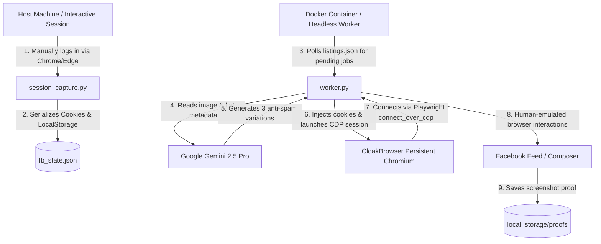

# AutoBVB: Stealth Shadow-Mode Real Estate Post Draft Automation

AutoBVB (Automated Broker-to-Buyer/Broker-to-Broker) is a production-grade, local shadow-mode execution worker designed to automate the drafting of authenticated real estate listings on Facebook. Specifically tailored for the Noida Extension rental market, the system combines Google GenAI models, persistent antidetect browser profiles, and robust browser-use frameworks to achieve resilient, bot-detection-resistant automation.

The core design philosophy is **Shadow-Mode Execution**: the worker automates the complex steps of navigating Facebook's DOM, bypassing interactive blockers, uploading multiple high-resolution images, and typing AI-optimized marketing copy, but halts **immediately before publication** to allow manual review, ensuring 100% safety and account preservation.

---

## 🏗️ System Architecture & Data Flow

Below is the conceptual flow of the authentication extraction and autonomous shadow-drafting pipelines:



---

## ⚡ Technical Core Capabilities

### 1. Antidetect & Stealth Browser Integration
* **CloakBrowser Persistent Contexts**: Bypasses Meta's advanced headless detection frameworks by employing a customized anti-detect browser binary (`cloakbrowser`) connected via standard Chrome DevTools Protocol (CDP) on port `9222`.
* **Playwright over CDP**: Decouples the browser runtime from the script runtime. The python worker executes commands natively through a `playwright.async_api.connect_over_cdp` hook, making the automation indistinguishable from a user operating a persistent local browser.

### 2. State-of-the-Art Generative Marketing (Hermes Content Agent)
* **Visual Context-Aware Copywriting**: Employs the `gemini-2.5-pro` model to evaluate property pictures directly against raw metadata (flat configuration, amenities, metro proximity).
* **Meta Spam Filter Evasion**: Generates exactly three structurally diverse variations of every caption:
  1. *The Gold Standard* (Highly structured, bulleted professional copy)
  2. *The Lifestyle Narrative* (Conversational, emotionally resonant storytelling)
  3. *The Short & Urgent* (High-urgency, scarcity-focused ad copy)
* **Zero-Markdown Serialization**: Explicitly filters and converts Markdown syntaxes (e.g., `**`, `_`, `#` headers) to raw emoji bullet points and block caps since Facebook's composer does not natively parse GFM.

### 3. Human Simulation Playwright Pipeline
* **React/Lexical Input Injection**: Rather than assigning raw text directly to the DOM (which breaks Facebook’s state management libraries), the worker implements dynamic character-by-character typing emulation (`page.keyboard.type(..., delay=20)`) to trigger synthetic key-up and input events correctly.
* **Aggressive Modals & Blocker Evasion**: Automatically handles unexpected layout shifts, cookie pop-ups, and welcome modals using keyboard escape sequences and highly generalized element location strategies.
* **Self-Healing File Locks**: Automatically tracks and purges stale Chromium lockfiles (e.g., `SingletonLock`, `SingletonCookie`) inside virtual directory volumes before launching Chromium in containerized environments.

---

## 📂 Codebase Subsystems

### 🔑 Authentication Capture
* **[`session_capture.py`](file:///d:/Projects/AutoBVB/session_capture.py)**: Spawns a visible, persistent native Google Chrome or MS Edge profile on the host OS. The user logs in manually to bypass 2FA and captchas, and the script serializes active cookies, origins, and `localStorage` to `fb_state.json`.
* **[`extract_state.py`](file:///d:/Projects/AutoBVB/extract_state.py)**: Headless alternative designed to connect to the existing persistent data directory (`./fb_browser_profile`) and cleanly extract authorization state without launching a GUI.
* **[`export_auth.py`](file:///d:/Projects/AutoBVB/export_auth.py)**: Simple helper that navigates to Facebook and saves session credentials after a 60-second delay.

### ⚙️ Core Worker Pipeline
* **[`worker.py`](file:///d:/Projects/AutoBVB/worker.py)**: The heartbeat of the system. Loops infinitely, polling the local database, extracting properties, invoking Gemini, establishing CDP handshakes, uploading images natively, and drafting the post.
* **[`content_engine.py`](file:///d:/Projects/AutoBVB/content_engine.py)**: Interfaces with the Google GenAI SDK to translate property assets into highly targeted नोएडा Extension rental advertisements.
* **[`shadow_test.py`](file:///d:/Projects/AutoBVB/shadow_test.py)**: Implements an autonomous agent using the open-source `browser-use` framework. Utilizes a vision-based `gemini-2.5-flash` model to dynamically navigate to Facebook, identify elements, and draft test listings.

### 🗄️ Database & Mock Storage
* **[`database.py`](file:///d:/Projects/AutoBVB/database.py)**: A zero-dependency, JSON-backed mock database (`listings.json`) that manages listing statuses (`pending`, `processing`, `shadow_success`, `shadow_failed`) to enable local testing without Cloud Firestore overhead.
* **[`storage.py`](file:///d:/Projects/AutoBVB/storage.py)**: Mock Google Cloud Storage module that securely routes output proofs (`proof.png`) to `local_storage/proofs`.

---

## 🚀 Setup & Execution Guide

### Prerequisite Environment Variables
Create a `.env` file in the root directory:
```env
GOOGLE_API_KEY=your_gemini_api_key
SHADOW_MODE=True
# Optional firebase mocks configuration
FIREBASE_CREDENTIALS=./service-accounts/firebase-key.json
GOOGLE_APPLICATION_CREDENTIALS=./service-accounts/firebase-key.json
GCP_PROJECT_ID=autobvb-xxxx
GCP_BUCKET_NAME=autobvb-xxxx.appspot.com
```

### 1. Interactive Session Capture (Run on Host Machine)
You must generate the state file on a machine with a display server so that you can complete the Facebook login:
```bash
# 1. Install dependencies
pip install -r requirements.txt
playwright install

# 2. Run interactive capture
python session_capture.py
```
*A browser window will open. Navigate to Facebook, log in, authorize your session, and then close the browser window.* The file `fb_state.json` will be generated locally.

### 2. Local Worker Mock Setup
Create or update `listings.json` with a pending listing:
```json
[
  {
    "id": "listing_001",
    "status": "pending",
    "flat_details": "3BHK Semi-Furnished, Sector 1 Noida Extension",
    "contact_number": "+91-9999999999",
    "metadata": {
      "image_paths": ["/app/local_storage/flat_image_1.jpg"]
    }
  }
]
```

### 3. Execution via Docker Compose
Build and run the headless shadow worker using Docker:
```bash
# Build the container
docker compose build

# Start the worker daemon
docker compose up -d
```
The container will launch `worker.py` which will actively poll `listings.json` every 10 seconds. When a listing moves to `processing`, it generates real estate copywriting via Gemini, launches `cloakbrowser` headlessly inside the container, attaches images, writes the composer draft, captures `/app/proof.png`, and marks the listing as `shadow_success`.

---

## 🛡️ Playwright Human Emulation Snippet
The following snippet from `worker.py` illustrates the robust and deterministic method used to bypass dynamic React component tracking on Facebook:

```python
# 1. Bulk Upload Images via the hidden input element directly in the DOM
file_input = page.locator('input[type="file"][accept*="image"]').first
await file_input.set_input_files(abs_image_paths)
await page.wait_for_timeout(random.randint(5000, 7000))

# 2. Inject Text using actual human-like keyboard delays to trigger Lexical events
editor_locator = page.locator('[contenteditable="true"]').first
await editor_locator.click()
await page.wait_for_timeout(500)
await page.keyboard.type(chosen_caption, delay=20) # 20ms human delay
```

---

## 🧪 Testing
To test agent-driven dynamic shadow navigation with vision models, verify your `.env` contains your `GOOGLE_API_KEY` and run:
```bash
python shadow_test.py
```
This triggers a high-fidelity vision agent that operates Facebook, writes `TEST_CAPTION` inside the composer, safely stops, and produces a complete full-page verification screenshot saved to `shadow_test_success.png`.
