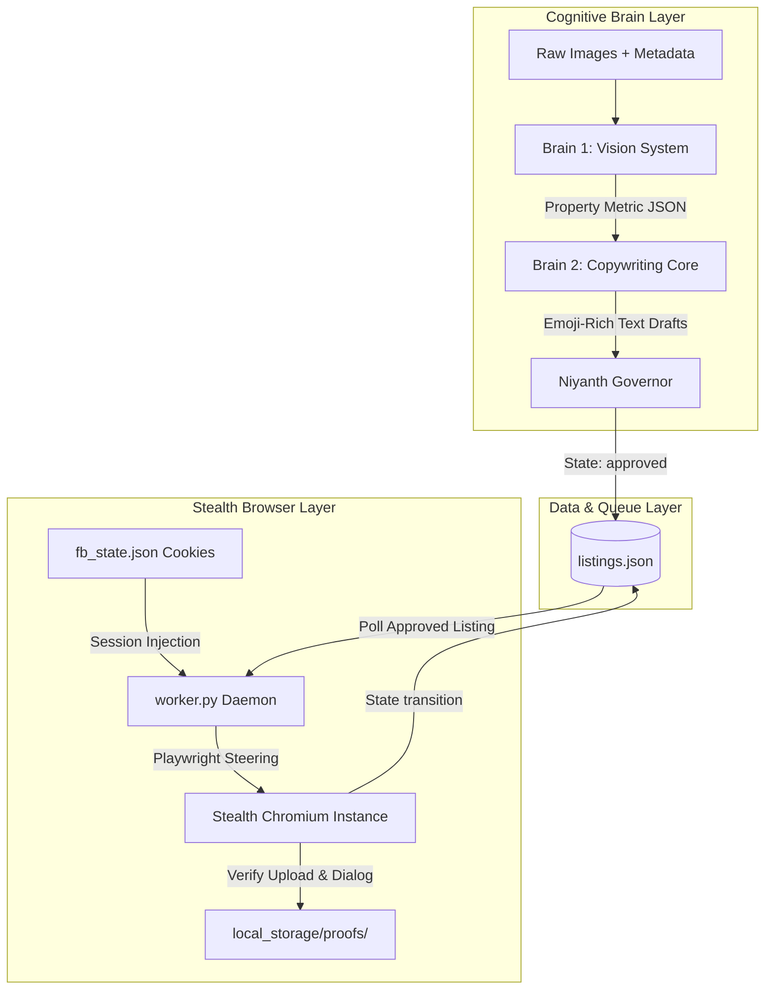

# AutoBVB v5.0 — Enterprise-Grade Agentic Real Estate Auto-Poster

An asymmetric, multi-tenant agentic real-estate marketing automation platform engineered to orchestrate visual analysis, copywriting synthesis, and stealth browser listing deployment with zero anti-bot detection overhead.

---

## 🚀 Executive Overview & High-Level Architecture

AutoBVB is designed as an asymmetric, agentic multi-brain automated real-estate marketing pipeline. Unlike monolithic automation scripts that attempt to perform reasoning and browser actions in a single execution thread, AutoBVB implements a clean separation of concerns between its **Cognitive Brain Layer** and its **Stealth Browser Layer**.



### Decoupled Separation of Concerns

1. **Cognitive Brain Layer**:
   - Executes heavy reasoning tasks: parsing raw property assets, auditing layout rules, synthesizing targeted ad copy variations, and verifying regulatory compliance.
   - Decoupled from the browser execution environment to ensure Gemini API consumption is isolated and failure-tolerant.
   
2. **Stealth Browser Layer**:
   - Executes deterministic DOM actions using Playwright.
   - Employs human-emulation parameters and pre-authenticated profile context injection to bypass login pages and multi-factor validation flows entirely.
   - Updates execution ledger states asynchronously to manage multi-tenant listing queues.

---

## 🧠 The Cognitive Engine Framework (Two-Brain Model)

The AutoBVB Cognitive Engine employs an asymmetric dual-brain pipeline to process visual context and generate high-converting promotional copies.

### Brain 1: Vision System
- **Role**: Factual visual parsing and attribute extraction.
- **Input**: Raw property image assets (`.jpg`, `.png`) combined with basic structural metadata.
- **Operations**: Uses a custom Gemini model prompt to audit properties, extracting room configurations, visible furnishing states (e.g., semi-furnished, fully-furnished), key amenities (e.g., modular kitchen, modular cupboards, swimming pool, gym, clubhouse access), structural condition, and proximity landmarks.
- **Output**: Generates a structured JSON payload containing raw extracted specs to act as a strict contract for Brain 2.

### Brain 2: Copywriting Core
- **Role**: High-conversion copywriting synthesis.
- **Input**: The verified JSON specifications contract emitted by Brain 1, contact numbers, and optional custom instructions.
- **Operations**: Utilizes unthrottled LLM orchestration to synthesize exactly three distinct copy variations (e.g., Gold Standard Professional, Lifestyle Narrative, Short & Urgent). Every variation is strictly formatted as plain, clipboard-safe text with rich emojis, zero markdown symbols (to prevent raw markdown syntax from pasting into social media posts), and defined character limits.
- **Graceful Degradation Fallback**: In the event of API rate limits or connection timeouts, Brain 2 gracefully degrades to compile a high-conversion Noida Extension marketing template containing preset metadata blocks to prevent pipeline disruption.

---

## 🥷 Core Stealth Automation Pipeline (Playwright & System Hooks)

The Stealth Browser Layer handles browser automation under strict anti-bot prevention frameworks using three main system hooks:

### Profile Cookie Syncing
To bypass credential validation and 2FA constraints, AutoBVB isolates Facebook authentication into a standalone session sync module:
- **Authentication Bypass**: The `export_auth.py` script opens a persistent, visual Chromium instance. The operator logs in manually and passes 2FA checks once.
- **Payload Extraction**: Active `.facebook.com` authentication tokens—including `c_user`, `xs`, `fr`, and `datr`—are extracted directly from the page context and saved into an isolated profile subdirectory (`local_storage/profiles/test_agent_01/fb_state.json`).
- **Context Injection**: During automation cycles, the worker reads this cookie payload and injects it directly into the new browser context. The target page loads pre-authenticated, completely bypassing standard login pages.

### DOM Resiliency Layer
Standard element interactions are highly vulnerable to UI race conditions, dynamic React render cycles, and translucent modal overlays:
- **Dialog Scoping**: Playwright Locators target the active composer dialog using `div[role="dialog"]` to isolate operations from underlying feed interactions.
- **Race Condition Handling**: The worker waits explicitly for CSS state transitions, using visibility-based assertions before attempting clicks.
- **Forced Actions**: To circumvent non-interactive overlay states and scroll-blocking wrappers, selectors utilize forced event dispatches and native Playwright coordinate steering to interact with inputs.

### Native Clipboard Injection & Fingerprint Masking
AutoBVB eliminates common bot behaviors like programmatic typing speed and visible automation flags:
- **Clipboard Injection**: programmatically pastes copy blocks into the rich-text editor (Lexical/React-based) rather than using `locator.type()`. This avoids text corruption, retains line breaks, and simulates a human copy-paste operation.
- **Fingerprint Masking**: Restricts the browser from leaking automation markers:
  - Disables Chromium control parameters (`--disable-blink-features=AutomationControlled`).
  - Clears default infobars and overrides `--enable-automation` flags.
  - Injects realistic viewport settings (`1280x720`), random browser user-agents, locale variables (`en-US`), and local timezones (`Asia/Kolkata`).

---

## 🛡️ Enterprise Guardrails: Shadow-Mode Staging

AutoBVB enforces strict compliance boundaries by preventing the execution of final public submissions during test and staging operations.

```
[Listing Claimed]
        │
        ▼
[Inject Auth Cookies]
        │
        ▼
[Stage Property Media]
        │
        ▼
[Paste Copied Caption]
        │
        ▼
[Capture High-Res Verification Proof] ──> Saved to local_storage/proofs/
        │
        ▼
[Bypass Submit Action]                 ──> Shadow-Mode halts before "Publish"
        │
        ▼
[Update Ledger: shadow_success]
```

- **Staging Verification**: The browser navigates to Facebook, attaches all seeded media files, pastes the generated copy variation into the composer text area, and pauses.
- **Proof Generation**: The automation engine captures a full-viewport high-resolution screenshot and saves it directly to `local_storage/proofs/{draft_id}_proof.png`.
- **Ledger State Transition**: Instead of executing the final click on the post submit button, the worker cleanly closes the session, updating the listing queue entry state inside `listings.json` to `shadow_success`.
- **Manual Sign-off**: Operators can manually inspect the saved proof images to review exact layout compliance, text alignment, and image rendering before pushing listings live.

---

## 📁 Complete Repository File-Map

Below is the directory map of the AutoBVB codebase along with concrete engineering responsibilities:

```
AutoBVB/
├── api.py                           # FastAPI micro-server hosting REST endpoints for draft generation and approval
├── database.py                      # Flat-file database controller mapping local listings.json data states
├── content_engine.py                # Asymmetric core coordinating Brain 1 (Vision) and Brain 2 (Copywriter) operations
├── niyanth.py                       # Pipeline governor coordinating asset verification and structural constraints
├── worker.py                        # Playwright-driven background daemon polling queue, injecting cookies, and staging posts
├── export_auth.py                   # Standalone UI-driven cookie sync layer exporting browser tokens to fb_state.json
├── verify_phase2_integration.py     # Primary parent integration test harness orchestrating multi-process simulations
├── _verify_api.py                   # Stub server configuring uvicorn to bypass asset checks during pipeline runs
├── _verify_e2e_wrapper.py           # Background mock worker client generating and approving test listings
├── listings.json                    # Flat-file local database tracking active jobs and queue states
└── local_storage/
    ├── flats01/                     # Noida property image assets (e.g. flat1.jpg)
    ├── profiles/                    # Isolated user cookie state files
    └── proofs/                      # Output directory containing verification proof screenshots
```

---

## ⚙️ Installation & Execution Guidelines

### 1. Install System Dependencies
Install python packages and download stealth-configured Playwright browser binaries:
```powershell
pip install -r requirements.txt
playwright install chromium
```

### 2. Configure Environment Variables
Create a `.env` file in the root directory:
```env
# Google Gemini Credentials
GEMINI_API_KEY=your_unthrottled_gemini_api_key

# Service URLs
BASE_URL="http://localhost:8000"

# Safety Configurations
SHADOW_MODE=True
AUTOBVB_LOCAL_STORAGE="D:\Projects\AutoBVB\local_storage"
```

### 3. Extract Session Cookies (One-Time Setup)
Initialize your local profile auth cookies:
```powershell
python export_auth.py
```
Log in manually to Facebook, resolve 2FA screens, load the feed, and press **Enter** in the terminal console to export `fb_state.json`.

### 4. Trigger the Master Integration Suite
Execute the multi-process integration script in unbuffered, UTF-8 mode to verify structural compliance and review the visual proof output:
```powershell
python -X utf8 -u verify_phase2_integration.py
```
This launches uvicorn, starts the worker daemon, creates a mock listing, runs the Two-Brain pipeline, restored cookies, stages the listing, and saves a proof screenshot inside `local_storage/proofs/` before exiting.